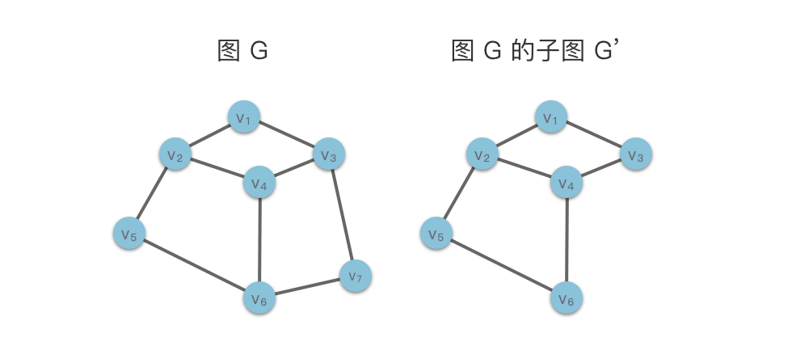
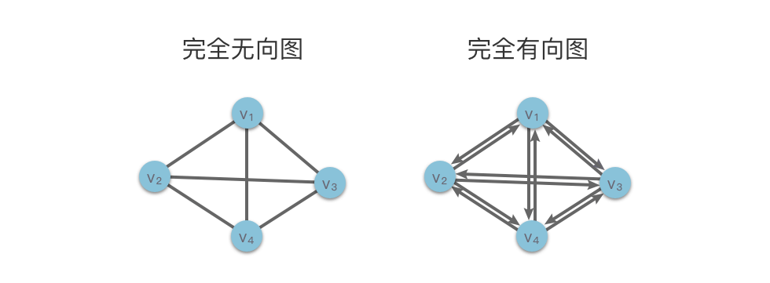
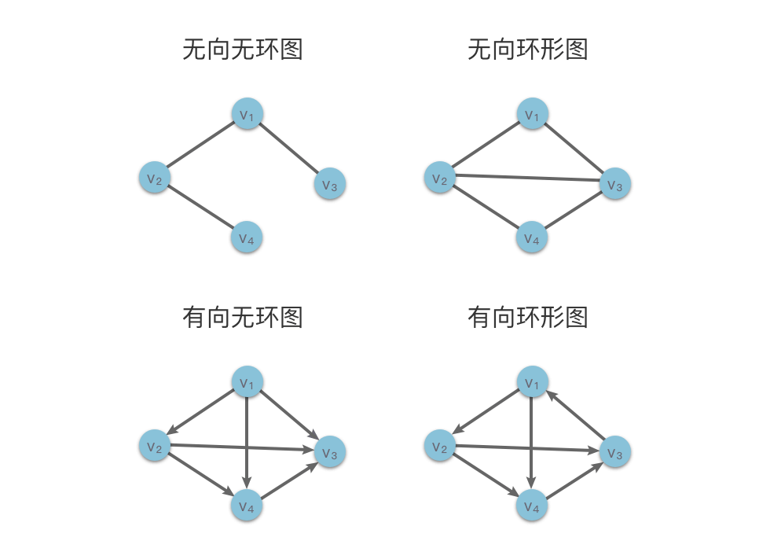
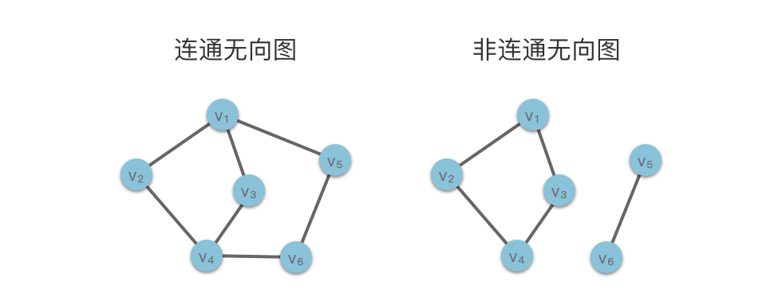
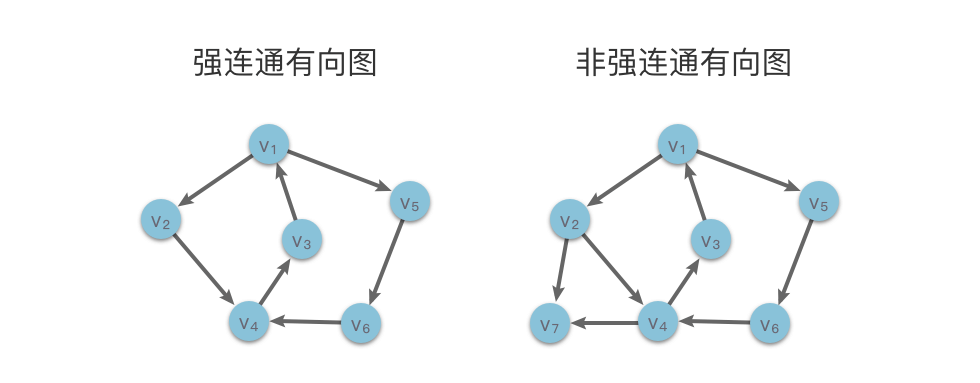
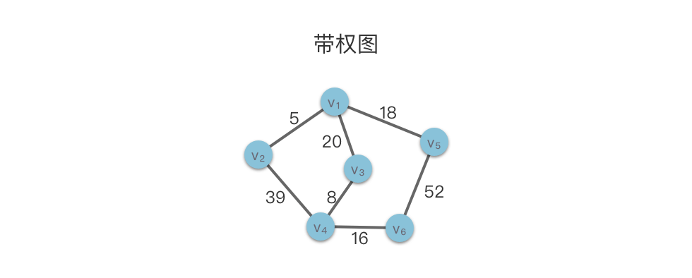

# 图

> 图的定义
> 由顶点的非空有限集合 V （由 n>0 个顶点组成）与边的集合 E（顶点之间的关系）构成的结构。其形式化定义为 G=(V,E)。

- 顶点
- 边 边的形式化定义为：e=⟨u,v⟩，表示从 u 到 v 的一条边，其中 u 称为起始点，v 称为终止点。
- 子图
  对于图 G=(V,E) 与 G′ =(V′ ,E′)，如果存在 V′⊆V，E'⊆E，则称图 G'是图 G 的一个子图。在下面的示意图中我们给出了一个图 G 及其一个子图。特别的，根据定义，G 也是其自身的子图。
  

`图的分类`

1. 无向图
   如果无向图中有 n 个顶点，则无向图中最多有 n×(n−1)/2 条边。而具有 n×(n−1)/2 条边的无向图称为 「完全无向图（Completed Undirected Graph）」。
2. 有向图
   如果有向图中有 n 个顶点，则有向图中最多有 n×(n−1) 条弧。而具有 n×(n−1) 条弧的有向图称为「完全有向图（Completed Directed Graph）」。

   

   `顶点的度`
   顶点的出度：以顶点为起始点的边的数量。
   顶点的入度：以顶点为终止点的边的数量。
   ==顶点的度==定义为：
   有向图中顶点的度定义为：一个顶点 v 的度是 v 的入度加出度。
   无向图中顶点的度定义为：一个顶点 v 的度是 v 的所有边数。

3. 环形图和无环图

- 路径：简单来说，如果顶点 u 可以通过一系列的顶点和边，到达顶点 v，则称顶点 u 和顶点 v 之间有一条路径，其中经过的顶点序列则称为两个顶点之间的路径。。

- 环：如果一条路径的起点和终点相同，则称该路径为一个环。
- 简单路径：如果一个路径中不包含重复的顶点，则称该路径为一个简单路径。

- 无环图：如果一个图没有环，则称该图为一个无环图。

- 环形图： 如果一个图有环，则称该图为一个环形图。

特别的，在有向图中，如果不存在环路，则将该图称为「有向无环图（Directed Acyclic Graph）」，缩写为 DAG。因为有向无环图拥有为独特的拓扑结构，经常被用于处理动态规划、导航中寻求最短路径、数据压缩等多种算法场景。



4. 连通图和非连通图

   `连通无向图和连通分量`
   在无向图中，如果从顶点 vi​ 到顶点 vj ​ 有路径，则称顶点 vi​ 和 vj 是连通的

   - 连通无向图 ：在无向图中，如果图中任意两个顶点之间都是连通的，则称该图为连通无向图
   - 非连通无向图：在无向图中，如果图中至少存在一对顶点之间不存在任何路径，则该图称为非连通无向图。

   

   下面介绍一下无向图的`「连通分量」`概念。有些无向图可能不是连通无向图，但是其子图可能是连 通的。这些子图称为原图的连通子图。而无向图的一个极大连通子图（不存在包含它的更大的连通 子图）则称为该图的「连通分量」。

   - 连通子图：如果无向图的子图是连通无向图，则该子图称为原图的连通子图。
   - 连通分量：无向图中的一个极大连通子图（不存在包含它的更大的连通子图）称为该图的连通分量。
   - 极大连通子图：无向图中的一个连通子图，并且不存在包含它的更大的连通子图。

   `强连通有向图和强连通分量`
   在有向图中，如果从顶点 vi​ 到 vj​ 有路径，并且从顶点 vj​ 到 vi​ 也有路径，则称顶点 vi 与 vj 是连通的。

   - 强连通有向图：如果图中任意两个顶点之间都是连通的，则称该图为强连通有向图。
   - 非强连通有向图：如果图中至少存在一对顶点之间不存在任何路径，则该图称为非强连通有向图。

   

   与无向图类似，有向图的一个极大强连通子图称为该图的 强连通分量。

   - 强连通子图：如果有向图的子图是连通有向图，则该子图称为原图的强连通子图。
   - 强连通分量：有向图中的一个极⼤强连通⼦图，称为该图的强连通分量。
   - 极⼤强连通⼦图：有向图中的一个强连通子图，并且不存在包含它的更大的强连通子图。

5. 带权图

- 带权图：如果图的每条边都被赋以⼀个权值，这种图称为带权图。
- 网络：带权的连通⽆向图称为⽹络。

  

  6. 稠密图和稀疏图

## 图的存储结构

图的结构比较复杂，我们需要表示顶点和边。一个图可能有任意多个（有限个）顶点，而且任何两个顶点之间都可能存在边。我们在实现图的存储时，重点需要关注边与顶点之间的关联关系，这是图的存储的关键。

图的存储可以通过「顺序存储结构」和「链式存储结构」来实现。其中顺序存储结构包括邻接矩阵和边集数组。链式存储结构包括邻接表、链式前向星、十字链表和邻接多重表。

接下来我们来介绍几个常用的图的存储结构。在下文中，我们约定用 n 代表顶点数目，m 代表边数目，TD(vi) 表示顶点 vi ​ 的度。

1. 邻接矩阵
   使用一个二维数组表示顶点之间的关系。

- 无权图： 顶点 vi 和 vj​ 之间存在边，则 [vi, vj]的值为 1，否则为 0。
- 有权图： 顶点 vi 和 vj​ 之间存在边，则 [vi, vj]的值为边的权值 w，否则为 无穷大。

```js
//
class Graph {
  constructor() {
    this.vertices = []; // 顶点列表
    this.adjMatrix = []; // 邻接矩阵
  }

  // 添加顶点
  addVertex(vertex) {
    if (!this.vertices.includes(vertex)) {
      this.vertices.push(vertex);
      const len = this.vertices.length;
      for (let i = 0; i < len; i++) {
        this.adjMatrix[i].push(0);
      }
      const row = new Array(len).fill(0);
      this.adjMatrix.push(row);
    }
  }
  // 添加边
  addEdge(vertex1, vertex2, weight = 1) {
    const index1 = this.vertices.indexOf(vertex1);
    const index2 = this.vertices.indexOf(vertex2);
    if (index1 !== -1 && index2 !== -1) {
      this.adjMatrix[index1][index2] = weight;
      this.adjMatrix[index2][index1] = weight; // 无向图
    }
  }

  // 删除边
  removeEdge(vertex1, vertex2) {
    const index1 = this.vertices.indexOf(vertex1);
    const index2 = this.vertices.indexOf(vertex2);
    if (index1 !== -1 && index2 !== -1) {
      this.adjMatrix[index1][index2] = 0;
      this.adjMatrix[index2][index1] = 0; // 无向图
    }
  }

  // 获取邻接矩阵
  getAdjMatrix() {
    return this.adjMatrix;
  }

  // 打印邻接矩阵
  printAdjMatrix() {
    console.log("邻接矩阵:");
    console.log("   " + this.vertices.join(" "));
    for (let i = 0; i < this.vertices.length; i++) {
      console.log(this.vertices[i] + " " + this.adjMatrix[i].join(" "));
    }
  }
}

// 示例用法
const graph = new Graph();
graph.addVertex("A");
graph.addVertex("B");
graph.addVertex("C");
graph.addVertex("D");

graph.addEdge("A", "B", 1);
graph.addEdge("A", "C", 2);
graph.addEdge("B", "D", 3);
graph.addEdge("C", "D", 4);
graph.printAdjMatrix();
```

2. 十字链表
3. 链式前向星
4. 哈希表实现邻接表
