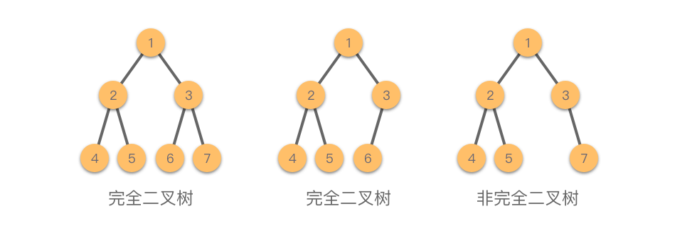
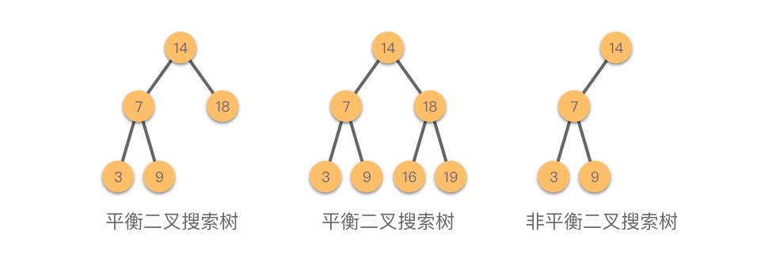

# 树

> 定义
> 树是由 n 个节点组成的非线性数据结构，其中 n>=0，n=0 表示空树。

「树」具有以下的特点：

- 有且仅有一个节点没有前驱节点，该节点被称为树的 「根节点（Root）」 。
- 除了根节点以之，每个节点有且仅有一个直接前驱节点。
- 包括根节点在内，每个节点可以有多个后继节点。
- 当 n>1 时，除了根节点之外的其他节点，可分为 m(m>0)m(m>0) 个互不相交的有限集合 T1,T2,...,Tm,其中每一个集合本身又是一棵树，并且被称为根的 「子树（SubTree）」。

相关术语

- 根节点：树中唯一没有前驱节点的节点。
- 节点：树中的元素。
- 度：一个节点包含的子节点个数。
- 分支节点：含有子节点的节点 度不为 0。
- 叶子节点：无子节点的节点 度为 0。
- 节点的层次：从根节点开始定义，根为第 1 层，根的子节点为第 2 层，以此类推
- 节点的深度：从根节点开始定义，根的深度为 0，根的子节点的深度为 1，以此类推
- 路径：树中两个节点之间路径上经过的节点序列
- 路径长度：两节点上经过的边数之和
- 节点的祖先： 从根节点到当前节点的路径上所有节点
- 节点的子孙：节点的子树中所有节点被称为该节点的子孙

树的分类

- 有序树： 节点的各个子树从左至右有序，不能互换位置
- 无序树： 节点的各个子树可以互换位置

## 二叉树

二叉树可以使用递归的方式来定义，二叉树需满足下面两个要求之一：

- 空树： 二叉树为空树，即根节点为空。
- 非空树：二叉树时由一个根节点和两颗互不相交的子树 T1，T2 组成的。其中 T1 和 T2 都是二叉树。

⼆叉树是种特殊的树，它最多有两个⼦树，分别为左⼦树和右⼦树，并且两个子树是有序的，不可以互换。也就是说，在⼆叉树中不存在度⼤于 2 的节点

二叉树逻辑上可以分为以下 5 中基本形态：


`特殊二叉树`

> 满二叉树： 所有节点都有两个子节点，并且所有叶子节点都在同一层。


> 完全二叉树： 如果叶子节点只能出现在最下面两层，并且最下层的叶子节点都依次排列在该层最左边的位置上，具有这种特点的二叉树称为完全二叉树。

完全二叉树满足以下特点：

- 叶子节点只能出现在最下面两层。
- 最下层的叶子节点一定集中在该层最左边的位置上。
- 倒数第二层如果有叶子节点，则该层的叶子节点一定集中在右边的位置上。
- 如果节点的度为 1，则该节点只偶遇左孩子节点，即不存在只有右子树的情况。
- 同等节点数的二叉树中，完全二叉树的深度最小。



> 二叉搜索树 也叫做二叉查找树、有序二叉树或者排序二叉树。
> 是指一棵空树或者具有下列性质的二叉树：

- 若任意节点的左子树不空，则左子树所有节点的值均小于它的根节点的值；
- 若任意节点的右子树不空，则右子树所有节点的值均大于它的根节点的值；
- 左、右子树也分别为二叉排序树。


根据这个特性，如果中序遍历二叉搜索树会得到一个递增的序列。

`二叉搜索树的查找`

按照二叉搜索树的定义，在进行元素查找时，我们只需要根据情况判断需要往左还是往右走。这样，每次根据情况判断都会缩小查找范围，从而提高查找效率。二叉树的查找步骤如下：

1. 如果二叉搜索树为空，则查找失败，结束查找，并返回空指针节点 None。
2. 如果二叉搜索树不为空，则将要查找的值 val 与二叉搜索树根节点的值 root.val 进行比较：

   - 如果 val==root.val，则查找成功，结束查找，返回被查找到的节点。
   - 如果 val< root.val，则递归查找左子树。
   - 如果 val> root.val，则递归查找右子树。

   ```js
   function findNode(root, val) {
     if (root == null) return null;
     if (val == root.val) return root;
     if (val < root.val) return findNode(root.left, val);
     return findNode(root.right, val);
   }
   ```

`二叉搜索树的插入`
在二叉搜索树中插入一个元素 val，需要满足以下条件：

```js
function insertNode(root, val) {
  if (root == null) return new TreeNode(val);
  if (val == root.val) return root;
  if (val < root.val) root.left = insertNode(root.left, val);
  if (val > root.val) rott.right = insertNode(root.right, val);
  return root;
}
```

`二叉搜索树的创建`

```js
function createBST(arr) {
  if (!arr.length) return null;
  const root = new TreeNode(arr[0]);
  for (let i = 1; i < arr.length; i++) {
    insertNode(root, arr[i]);
  }
}
```

`二叉搜索树的删除`

二叉搜索树的删除算法步骤如下：

1. 如果当前节点为空，则返回当前节点。
2. 如果当前节点值大于 val，则递归去左子树中搜索并删除，此时 root.left 也要跟着递归更新。
3. 如果当前节点值小于 val，则递归去右子树中搜索并删除，此时 root.right 也要跟着递归更新。
4. 如果当前节点值等于 val，则该节点就是待删除节点。
   - 如果当前节点的左子树为空，则删除该节点之后，则右子树代替当前节点位置，返回右子树。
   - 如果当前节点的右子树为空，则删除该节点之后，则左子树代替当前节点位置，返回左子树。
   - 如果当前节点的左右子树都有，则将左子树转移到右子树最左侧的叶子节点位置上，然后右子树代替当前节点位置。

```js
function findMin(node) {
  while (node.left) {
    node = node.left;
  }
  return node;
}

function deleteNode(root, key) {
  if (!root) return null;
  if (root.val > key) {
    root.left = deleteNode(root.left, key);
  } else if (root.val < key) {
    root.right = deleteNode(root.right, key);
  } else {
    if (!root.right && !root.left) return null;
    if (!root.left) {
      return root.right;
    }
    if (!root.right) {
      return root.left;
    }
    const minNode = findMin(root.right);
    root.val = minNode.val;
    root.right = deleteNode(root.right, minNode.val);
  }
  return root;
}
```

[在线生成二叉树的网站](https://hggshiwo.github.io/bitreepainter/index.html#/)
`8b[4b[2b[1b][3b]][6b[5r][7b]]][12b[10b[9b][11b]][14b[13b][15b]]]`

思考 ： 下面这段代码实现的是要删除的节点位置保持不动，把其右节点中的最小值的值赋给当前要删除的节点，
然后删除其右节点中的最小值。按下图所示： 假设要删除 4，由于 4 节点存在左右节点，要保证删除满足中序遍历是递增，先找到 4 右子树中的最小值 5，将 4 的值变为 5，同时删除 5 节点。

```js
const minNode = findMin(root.right);
root.val = minNode.val;
root.right = deleteNode(root.right, minNode.val);
```


> 平衡二叉搜索树
> 一种结构平衡的二叉搜索树。即叶节点高度差的绝对值不超过 1，并且左右两个子树都是一棵平衡二叉搜索树。平衡二叉树可以在
> O(logn) 内完成插入、查找和删除操作。最早被发明的平衡二叉搜索树为 「AVL 树（Adelson-Velsky and Landis Tree））」。

AVL 树满足以下性质

- 空二叉树是一棵 AVL 树；
- 如果 T 是一棵 AVL 树，则 T 的左子树和右子树都是 AVL 树，并且左子树的高度和右子树的高度差不超过 1;
- AVL 树的高度为 O(logn)



## 二叉树的存储结构

`顺序存储`

其实，堆排序、优先队列中的二叉堆结构，采用的就是二叉树的顺序存储结构。

二叉树的顺序存储结构使用一维数组来存储二叉树中的节点，节点存储位置则采用完全二叉树的节点层次编号，按照层次从上至下，每一层从左至右的顺序依次存放二叉树的数据元素。在进行顺序存储时，如果对应的二叉树节点不存在，则设置为「空节点」。

从图中我们也可以看出节点之间的逻辑关系。

如果某二叉树节点（非叶子节点）的下标为 i，那么其左孩子节点下标为 `2∗i+1`，右孩子节点下标为 `2∗i+2`。如果某二叉树节点（非根节点）的下标为 i，那么其根节点下标为 `(i−1)//2`。 // 表示整除。
对于完全二叉树（尤其是满二叉树）来说，采用顺序存储结构比较合适，它能充分利用存储空间；
而对于一般二叉树，如果需要设置很多的「空节点」，则采用顺序存储结构就会浪费很多存储空间。
并且，由于顺序存储结构固有的一些缺陷，会使得二叉树的插入、删除等操作不方便，效率也比较低。
对于二叉树来说，当树的形态和大小经常发生动态变化时，更适合采用链式存储结构。


`链式存储`

二叉树采用链式存储结构时，每个链节点包含一个用于数据域 val，存储节点信息；还包含两个指针域 left 和 right，分别指向左右两个孩子节点，当左孩子或者右孩子不存在时，相应指针域值为空。二叉链节点结构如下图所示。

二叉链节点： left- val - right


## 二叉树的遍历

> 二叉树的遍历： 指的是从根节点出发，按照某种次序依次访问二叉树中所有节点，使得每个节点被访问一次且仅被访问一次。

- 先序遍历：
  访问根节点，先遍历所有的左子树，再先序遍历右子树
  
- 中序遍历：
  中序遍历左子树，访问根节点，中序遍历右节点
  
- 后序遍历
- 后序遍历左子树，后序遍历右节点，访问根节点
  

- 层序遍历
- 层序遍历，从左至右边遍历每一层

```js
//实现二叉树的先序遍历
class Node {
  constructor(val) {
    this.val = val;
    this.left = null;
    this.right = null;
  }
}
const tree = new Node(1);
tree.left = new Node(2);
tree.right = new Node(3);
tree.left.left = new Node(4);
tree.left.right = new Node(5);
tree.right.left = new Node(6);
tree.right.right = new Node(7);

function preOrder(tree) {
  const result = [];
  traverse(tree, result);
}

function traverse(node, result) {
  if (node === null) return;
  result.push(node.val);
  traverse(node.left);
  traverse(node.right);
}

console.log(preOrder(tree));
```

```js
//实现二叉树的中序遍历
class TreeNode {
  constructor(val) {
    this.val = val;
    this.left = null;
    this.right = null;
  }
}
const tree = new TreeNode(1);
tree.left = new TreeNode(2);
tree.right = new TreeNode(3);
tree.left.left = new TreeNode(4);
tree.left.right = new TreeNode(5);
tree.right.left = new TreeNode(6);
tree.right.right = new TreeNode(7);

function middleOrder(node) {
  const result = [];
  tranverse(result, node);
}

function tranverse(result, node) {
  if (node === null) return;
  tranverse(result, node.left);
  result.push(node.val);
  tranverse(result, node.right);
}

console.log(middleOrder(tree));
```

```js
//实现二叉树的后序遍历
class TreeNode {
  constructor(val) {
    this.val = val;
    this.left = null;
    this.right = null;
  }
}
const tree = new TreeNode(1);
tree.left = new TreeNode(2);
tree.right = new TreeNode(3);
tree.left.left = new TreeNode(4);
tree.left.right = new TreeNode(5);
tree.right.left = new TreeNode(6);
tree.right.right = new TreeNode(7);

function postOrder(node) {
  const result = [];
  tranverse(result, node);
  return result;
}

function tranverse(result, node) {
  if (node === null) return;
  tranverse(result, node.left);
  tranverse(result, node.right);
  result.push(node.val);
}
console.log(postOrder(tree));
```

```js
//实现二叉树的层序遍历
class TreeNode {
  constructor(val) {
    this.val = val;
    this.left = null;
    this.right = null;
  }
}

const tree = new TreeNode(1);
tree.left = new TreeNode(2);
tree.right = new TreeNode(3);
tree.left.left = new TreeNode(4);
tree.left.right = new TreeNode(5);
tree.right.left = new TreeNode(6);
tree.right.right = new TreeNode(7);

function levelOrder(tree) {
  if (tree === null) return;
  const result = [];
  const queue = [tree];
  while (queue.length) {
    const levelSize = queue.length;
    const level = [];
    for (let i = 0; i < levelSize; i++) {
      const node = queue.shift();
      level.push(node.val);
      if (node.left) queue.push(node.left);
      if (node.right) queue.push(node.right);
    }
    result.push(level);
  }
  return result;
}
```

## 二叉树的还原

以下条件可以唯一的确定一棵树：

- 已知 `前序遍历`和`中序遍历`
- 已知 `中序遍历`和`后序遍历`
- 已知 `中序遍历`和`层序遍历`

不能唯一确定：

- 已知 `前序遍历`和`后序遍历`

==因为中序遍历可以将树 fen 分为左右子树==

```js
// 前序和中序还原二叉树
// 定义二叉树节点类
class TreeNode {
  constructor(val) {
    this.val = val;
    this.left = null;
    this.right = null;
  }
}

// 根据前序遍历和中序遍历还原二叉树
function buildTree(preorder, inorder) {
  if (preorder.length === 0 || inorder.length === 0) {
    return null;
  }

  // 前序遍历的第一个元素是根节点
  const rootVal = preorder[0];
  const root = new TreeNode(rootVal);

  // 在中序遍历中找到根节点的位置
  const rootIndex = inorder.indexOf(rootVal);

  // 左子树的前序遍历和中序遍历
  const leftPreorder = preorder.slice(1, 1 + rootIndex);
  const leftInorder = inorder.slice(0, rootIndex);

  // 右子树的前序遍历和中序遍历
  const rightPreorder = preorder.slice(1 + rootIndex);
  const rightInorder = inorder.slice(rootIndex + 1);

  // 递归构建左子树和右子树
  root.left = buildTree(leftPreorder, leftInorder);
  root.right = buildTree(rightPreorder, rightInorder);

  return root;
}

// 示例：前序遍历和中序遍历
const preorder = [3, 9, 20, 15, 7];
const inorder = [9, 3, 15, 20, 7];

// 还原二叉树
const tree = buildTree(preorder, inorder);

// 辅助函数：打印二叉树（前序遍历）
function printTree(node) {
  if (node === null) return;
  console.log(node.val);
  printTree(node.left);
  printTree(node.right);
}

// 打印还原后的二叉树
printTree(tree);
```

## 线段树

> 线段树是一棵平衡二叉树，树上的每个节点维护一个区间。根节点维护的是整个区间，每个节点维护的是父亲节点的区间二等分之后的其中一个子区间。
> 当有 n 个元素时，对区间的操作（单点更新、区间更新、区间查询等）可以在 O(log 2n) 的时间复杂度内完成。

特点：


```js
// 创建线段树
class SegmentTreeNode {
  constructor(start, end, sum) {
    this.start = start; // 区间开始
    this.end = end; // 区间结束
    this.sum = sum; // 区间和
    this.left = null; // 左子节点
    this.right = null; // 右子节点
  }
}

class SegmentTree {
  constructor(nums) {
    this.root = this.build(nums, 0, nums.length - 1);
  }

  // 构建线段树
  build(nums, start, end) {
    if (start > end) return null;
    const node = new SegmentTreeNode(start, end, 0);
    if (start === end) {
      node.sum = nums[start];
    } else {
      const mid = Math.floor((start + end) / 2);
      node.left = this.build(nums, start, mid);
      node.right = this.build(nums, mid + 1, end);
      node.sum = node.left.sum + node.right.sum;
    }
    return node;
  }

  // 查询区间 [left, right] 的和
  query(left, right) {
    return this.queryNode(this.root, left, right);
  }

  // 递归查询
  queryNode(node, left, right) {
    if (left > node.end || right < node.start) return 0; // 区间不重叠
    if (left <= node.start && right >= node.end) return node.sum; // 区间完全包含
    const mid = Math.floor((node.start + node.end) / 2);
    let sum = 0;
    if (left <= mid) sum += this.queryNode(node.left, left, right);
    if (right > mid) sum += this.queryNode(node.right, left, right);
    return sum;
  }

  // 更新位置 index 的值为 val
  update(index, val) {
    this.updateNode(this.root, index, val);
  }

  // 递归更新
  updateNode(node, index, val) {
    if (node.start === node.end) {
      node.sum = val;
      return;
    }
    const mid = Math.floor((node.start + node.end) / 2);
    if (index <= mid) {
      this.updateNode(node.left, index, val);
    } else {
      this.updateNode(node.right, index, val);
    }
    node.sum = node.left.sum + node.right.sum;
  }
}

// 示例用法
const nums = [1, 3, 5, 7, 9, 11];
const segmentTree = new SegmentTree(nums);

console.log(segmentTree.query(1, 3)); // 输出 15 (3 + 5 + 7)
segmentTree.update(1, 10); // 更新位置 1 的值为 10
console.log(segmentTree.query(1, 3)); // 输出 22 (10 + 5 + 7)
```

## 树状数组

## 并查集
