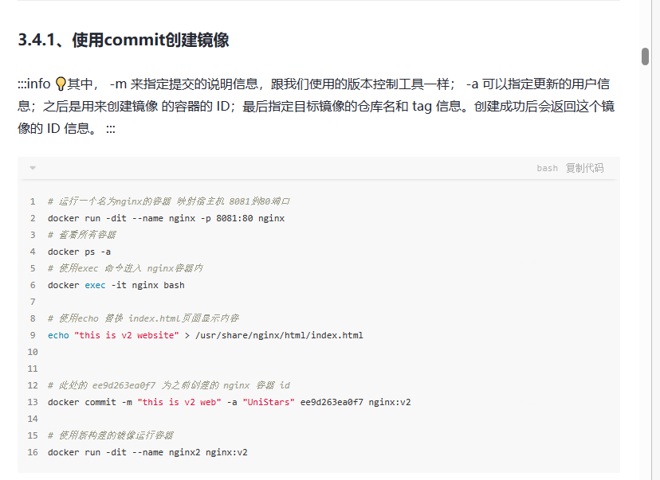
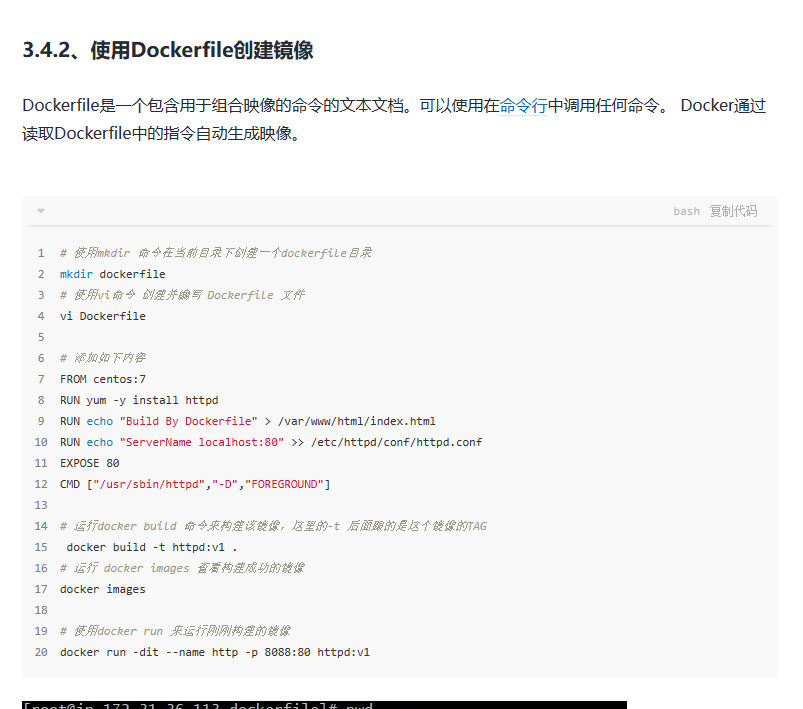
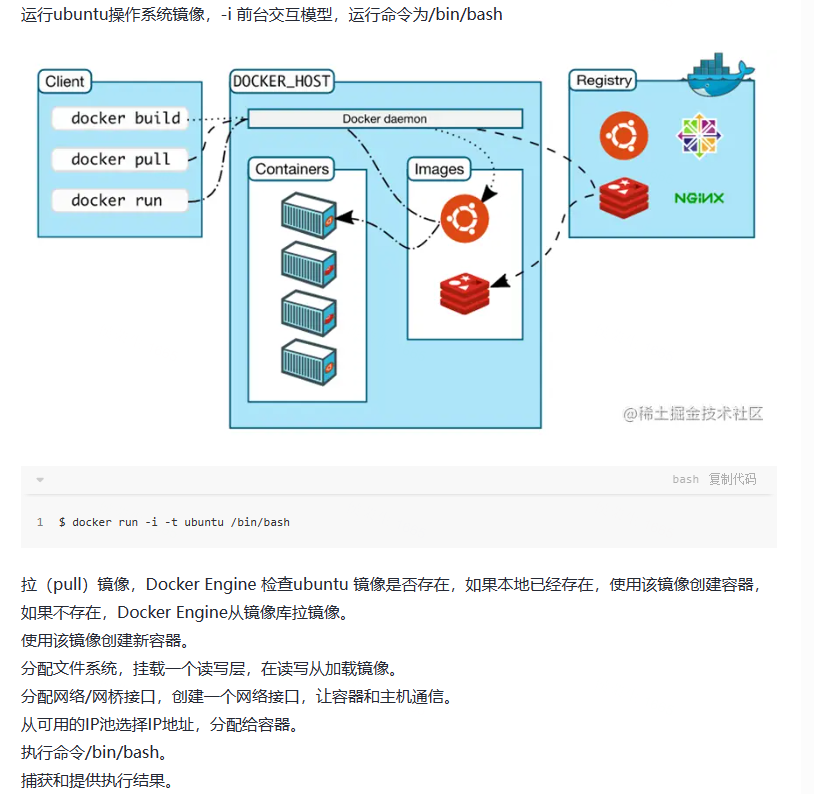
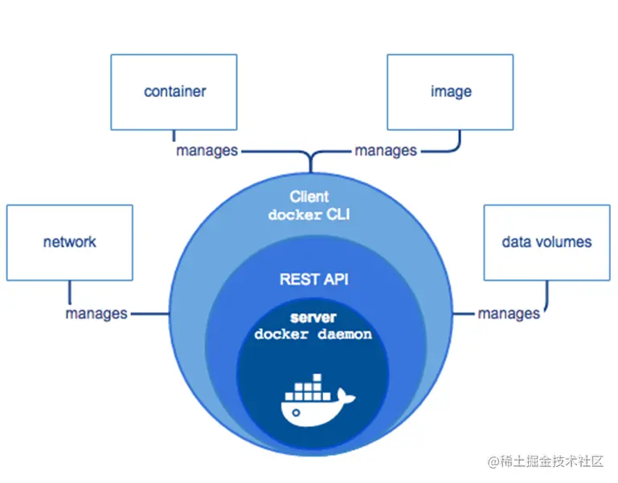
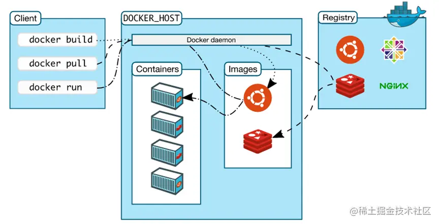

### 
 docker

[文档来源](https://juejin.cn/post/7132756861626875917?searchId=202307190939028FD93DD4F8F9FB2B8B84)

###### - docker 组成

- docker 客户端
  - 命令行(CLI)交互客户端。客户端使用 REST API 接口同 Docker daemon 进行访问
- Docker Daemon 守护进程
  - 用于管理 Docker 对象：镜像，容器，网络，数据卷
- Docker image 镜像
  - 一个制度模板，用于创建 docker 容器，由 Dockerfile 文本描述镜像内容
  - 拉取和列出镜像
    - docker pull images:tag
    - docekr images
  - 创建镜像
    - 使用 commit 创建镜像
    - 
  - DockerFile 文件的基本指令
    - FROM 定义基础镜像
    - MAINTAINER 作者或维护者
    - RUN 运行 linux 命令
    - ADD 增加文件或目录
    - EVN 定义环境变量
    - CMD 运行进程
    - 示例(文档中有详解内容)
      
- DockerContainer 容器 - 是一个镜像的运行实例
  - 运行过程
     1.运行`$ docker run -i -t ubuntu /bin/bash`拉取镜像
    2.Docker Engine 检查 ubuntu 镜像是否存在，如果本地已经存在，使用该镜像创建容器，如果不存在，Docker Engine 从镜像库拉取镜像，使用该镜像创建新容器 3.分配文件系统，挂载一个读写层，在读写层加载镜像 4.分配网络/网桥接口，创建一个网络接口，让容器和主机通信 5.从可用的 IP 池选择 IP 地址，分配给容器 6.执行命令/bin/bash 捕获和提供执行结果
- Docker Registry 仓库
  
  
