## 示例文件夹目录 D:\\\：

```shell
├─ flutter
│ ├─ flutterSdk    # 存放 flutter sdk
│ ├─ androidStudio # 存放 androidStudio 编辑器
│ ├─ androidSdk    # 存放 android sdk
```

[官方中文文档](https://docs.flutter.cn/reference/widgets)

## 安装 flutter sdk

1. 安装 [flutter sdk](https://docs.flutter.cn/release/archive?tab=windows)

2. 配置系统环境变量

   - Path 中 添加 flutter/bin 例如： `D:\flutter\flutterSdk\bin`
     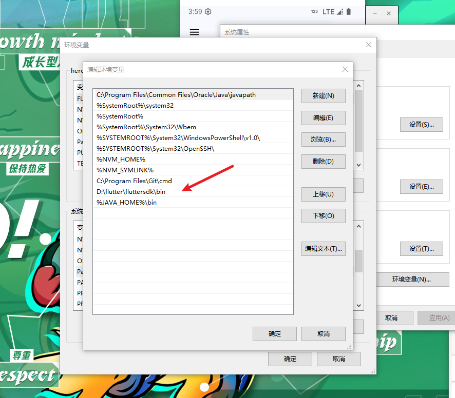
   - 添加系统变量,用于配置镜像
     | 变量名 | 变量值 |
     | :---: | :---: |
     |`PUB_HOSTED_URL`|`https://pub.flutter-io.cn`|
     |`FLUTTER_STORAGE_BASE_URL`|`https://storage.flutter-io.cn`|

     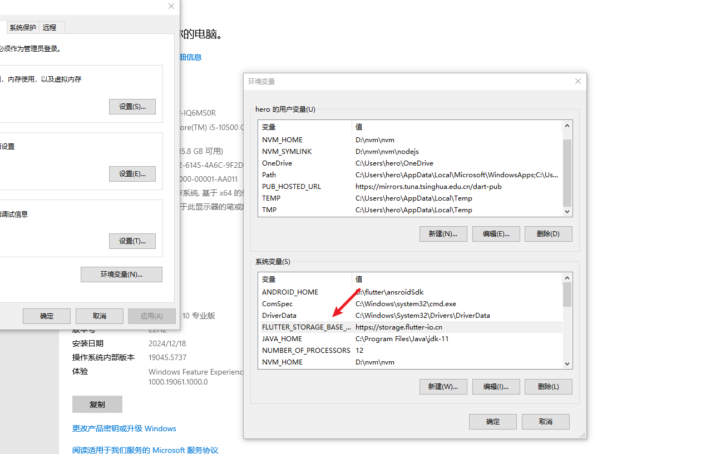
     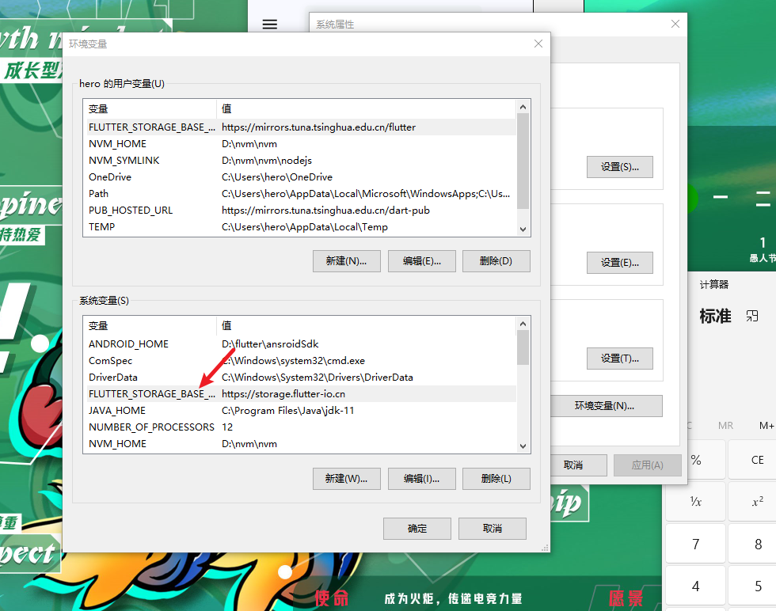

3. cmd 中执行 flutter --version 查看是否安装成功

4. cmd 中执行 flutter doctor 查看运行环境以及支持的平台

<!-- 5. 使用 vscode 编辑器 -->
   <!-- - 安装 flutter 插件 (会自动安装 dart 插件) -->

## 安装 android 工具链

1. 安装 [android sdk](https://developer.android.google.cn/studio?hl=zh-cn)
2. 配置系统环境变量 `ANDROID_HOME` 为 sdk 路径 例如：`D:\flutter\ansroidSdk`
   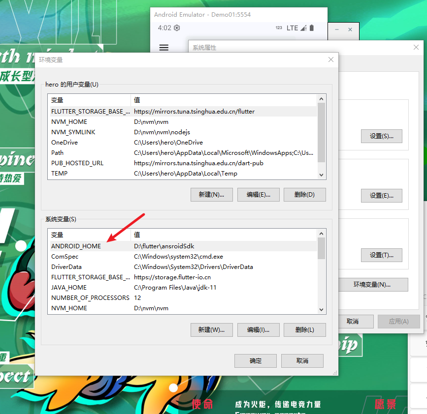
3. androidStudio 中安装 plugin : `flutter` + `dart` 插件
4. 设置中 Android SDK 安装以下组件
   - Android SDK Platform, API 35.0.2
   - Android SDK Command-line Tools
   - Android SDK Build-Tools
   - Android SDK Platform-Tools
   - Android Emulator
   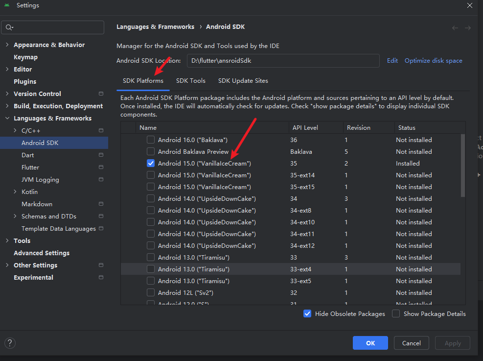
   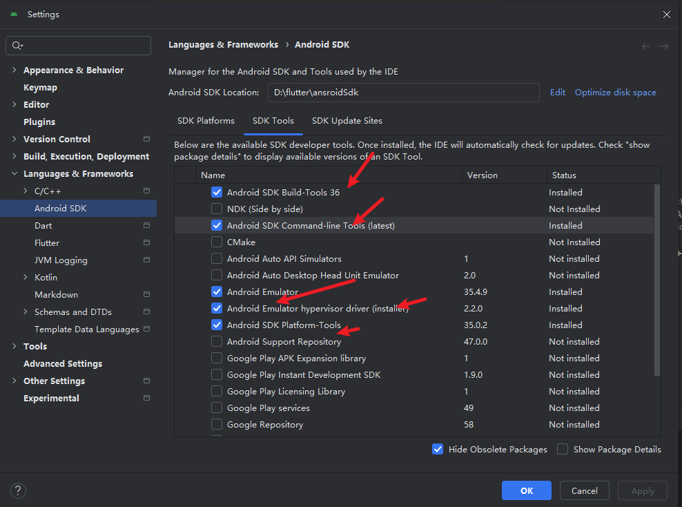
   <!-- 5. androidStudio 中配置模拟器 （ide 右侧 Device Manager） -->
5. 配置 Android 模拟器(在 vscode 中配置也可以)
   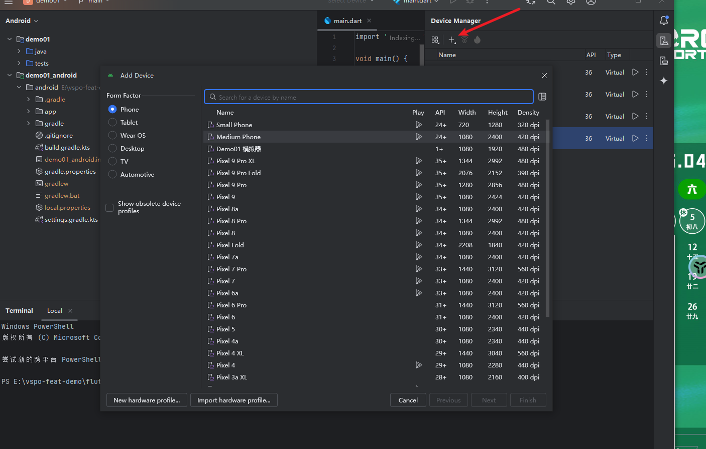

## vscode 编辑器配置

1. 安装 flutter 插件 (会自动安装 dart 插件)

2. 右下角选择对应虚拟机器，运行 flutter run 命令
   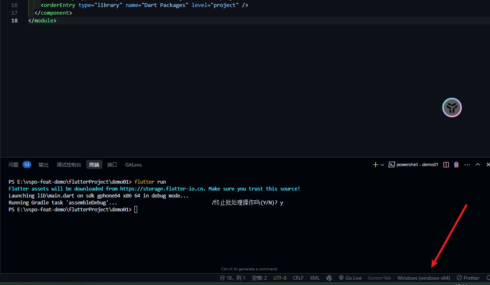

以上完成后，在 cmd 中运行 flutter doctor 查看是否正常
目前有证书 license 问题，需要按提示运行 flutter doctor --android-licenses

解决证书问题后，就只剩 Windows apps 的问题了
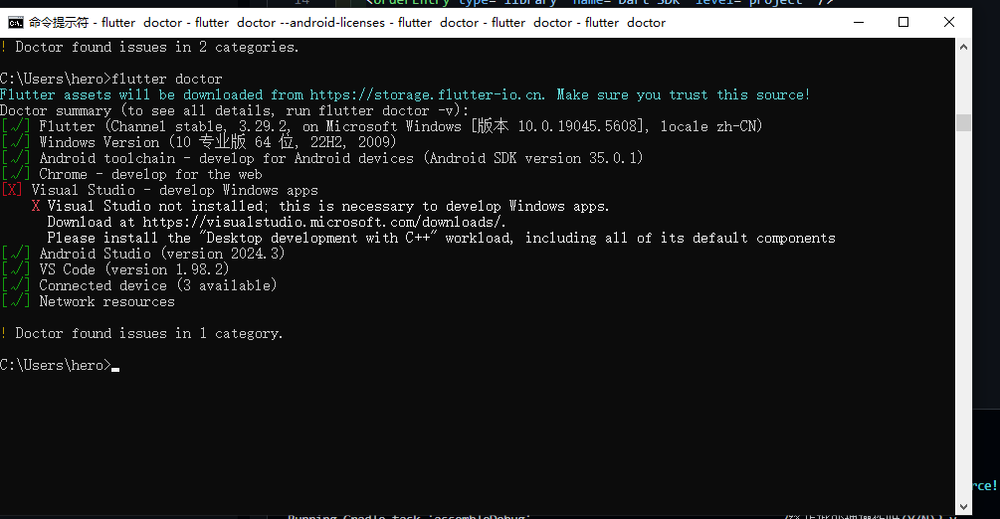

## 创建 flutter 项目

```bash
flutter create demo01
```

运行 flutter run 命令

可能会出现 Running Gradle task 'assembleDebug'... 报错问题

解决方法：
先尝试 3 是否成功,如果不成功按照以下顺序解决

1. 安装 java 11 环境 [java11 下载地址](https://www.oracle.com/java/technologies/downloads/#java11-windows)
2. 配置系统环境变量

   - 新建 JAVA_HOME 变量，值为 java 安装路径 例如：`C:\Program Files\Java\jdk-11.0.13`
   - 新建 PATH 变量，值为 `%JAVA_HOME%\bin`
   - 运行 cmd 命令，查看 java -version 是否正常

3. 更改 gradle 配置文件 \android\gradle\wrapper\gradle-wrapper.properties

```yml
# distributionUrl=https\://services.gradle.org/distributions/gradle-8.10.2-all.zip
distributionUrl=https://mirrors.aliyun.com/macports/distfiles/gradle/gradle-8.10.2-all.zip
```

## flutter devtools

vscode 中 ctrl + shift + P

Flutter: Open DevTools Performance Page 显示性能分析页面
Flutter: Open DevTools Widget inspector Page 显示控件树，定位控件的代码位置

## 断点调试(日常开发使用)

配置 launch.json,项目根目录添加使用默认生成的配置文件就可以
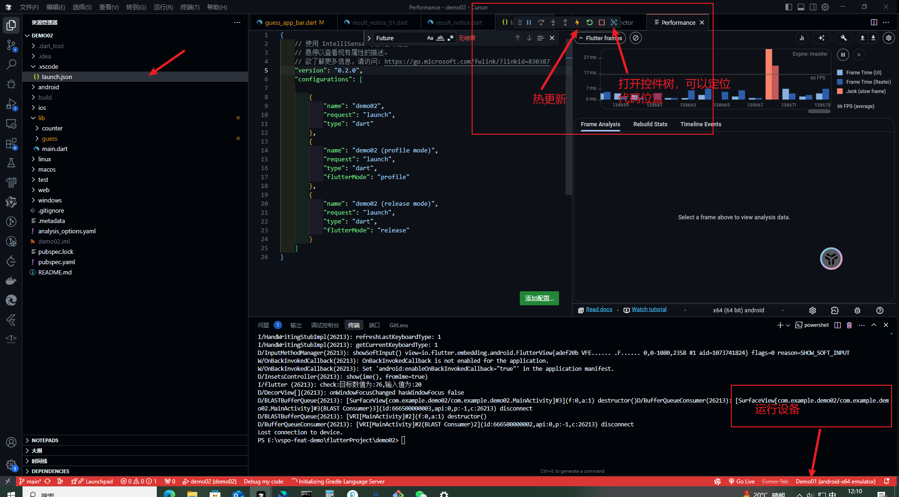

## 真机调试

连接手机后，开启开发者选项，直接控制台 flutter run 会自动检测，同意即可,然后选择对应的自己设备

如果没有网络权限开启网络权限 crtl+P 搜索 AndroidManifest.xml 文件添加

```xml
<uses-permission android:name="android.permission.INTERNET"/>
```

音频权限

```xml
<uses-permission android:name="android.permission.READ_EXTERNAL_STORAGE"/>
<uses-permission android:name="android.permission.WRITE_EXTERNAL_STORAGE"/>
```

一些真机调试相关命令

```bash
# 查看设备列表
flutter devices
# 多设备可以指定设备id
flutter run --device-id=<your_device_id>
# 正常启动，可以选择自己的设备
flutter run

# 如果失败可以尝试先清空build文件夹
# 重新获取依赖包
# 重新启动
flutter clean
flutter pub get
flutter run

```


安装包
[插件市场](https://pub-web.flutter-io.cn/)
方案一 `pubspec.yaml`中直接添加然后执行

```bash
flutter pub get
```

方案二（正常使用）

```bash
flutter pub add xxxx(包名)
```

## flutter 多版本管理 fvm

查看 flutter 通道 默认为 stable

```bash
# 查看通道
# stable 稳定版本
# beta   beta版本
# dev    开发版本
# master master版本 可能不稳定
flutter channel

# 切换通道
flutter channel stable

# 更新flutter
flutter upgrade


# 安装fvm
dart pub global activate fvm

# 查看fvm版本
fvm --version

# 安装flutter指定版本
fvm install 3.10.6

# 查看已安装的flutter版本
fvm list

# 切换flutter版本
fvm use 3.10.6


```

关于 fvm 安装

1. cmd

```bash
dart pub global activate fvm
```

安装后提示 安装在 c:\user\xxx\Pub\Cache\bin ,但路径不可用 配置环境变量就可以了

```shell
Path  ------> C:\Users\hero\AppData\Local\Pub\Cache\bin
```

fvm 运行某个版本的 flutter ,并在在 web 中打开

```bash
# 查看fvm flutter版本
fvm flutter --version

# 切换fvm flutter版本
fvm flutter use 3.10.6

# 构建fvm flutter项目
fvm flutter build web

fvm flutter run -d chrome
```

## flutter 构建 release 版本

1. android\app\src\main\AndroidManifest.xml 和 android\app\src\profile\AndroidManifest.xml
   这两个 xml 文件中配置应用名,权限

```xml
<!-- android\app\src\main\AndroidManifest.xml -->
<manifest xmlns:android="http://schemas.android.com/apk/res/android" >
 <uses-permission android:name="android.permission.INTERNET"/>
  <!-- 音频权限 -->
  <uses-permission android:name="android.permission.READ_EXTERNAL_STORAGE"/>
  <uses-permission android:name="android.permission.WRITE_EXTERNAL_STORAGE"/>

  <uses-permission android:name="android.permission.READ_PHONE_STATE" />
  <uses-permission android:name="android.permission.ACCESS_NETWORK_STATE" />
  <uses-permission android:name="android.permission.ACCESS_WIFI_STATE" />

 <application
     android:label="测试apk"
     android:name="${applicationName}"
     android:icon="@mipmap/ic_launcher">
     <activity
   ...

```

```xml
<!-- android\app\src\profile\AndroidManifest.xml -->
<manifest xmlns:android="http://schemas.android.com/apk/res/android" >
 <!-- The INTERNET permission is required for development. Specifically,
      the Flutter tool needs it to communicate with the running application
      to allow setting breakpoints, to provide hot reload, etc.
 -->
  <uses-permission android:name="android.permission.INTERNET"/>

  <!-- 音频权限 -->
  <uses-permission android:name="android.permission.READ_EXTERNAL_STORAGE"/>
  <uses-permission android:name="android.permission.WRITE_EXTERNAL_STORAGE"/>

  <uses-permission android:name="android.permission.READ_PHONE_STATE" />
  <uses-permission android:name="android.permission.ACCESS_NETWORK_STATE" />
  <uses-permission android:name="android.permission.ACCESS_WIFI_STATE" />
</manifest>

```

2. 配置不同 dpi 的应用图标，配置开屏界面 android\app\src\main\res
   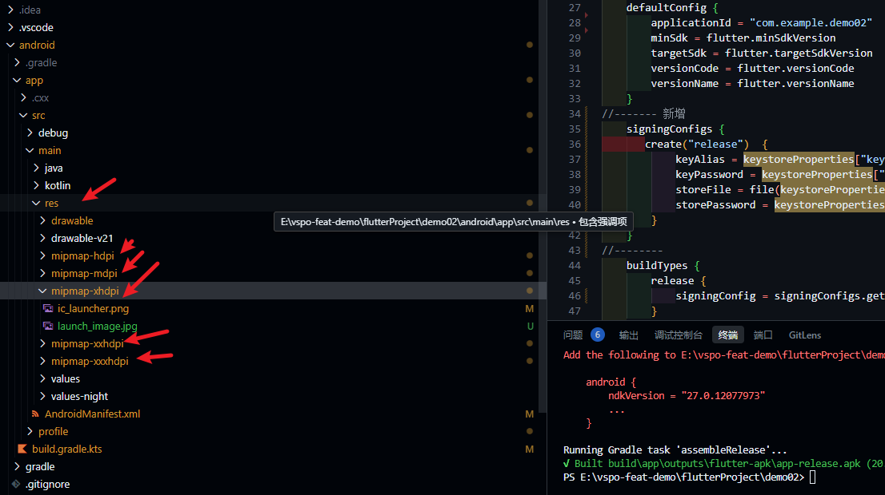
   [图标裁剪生成网站](https://icon.wuruihong.com/icon?utm_source=PvdA0H4n#/android)

android\app\src\main\res\drawable\launch_background.xml 这个文件中配置启动页

```xml
<layer-list xmlns:android="http://schemas.android.com/apk/res/android">
    <item android:drawable="@android:color/white" />
<!-- 启动页 -->
    <!-- You can insert your own image assets here -->
    <item>
        <bitmap
            android:gravity="fill"
            android:src="@mipmap/launch_image" />
    </item>
</layer-list>
```

[启动页图片生成](https://console.eeui.app/tools/launchimage)

3. 配置签名

   3.1 创建签名文件
   打开 cmd,执行下面的代码，按提示填写，生成 key.jks 文件 YourUsername 为你的用户名文件夹

   ```bash
   keytool -genkeypair -alias yourKeyAlias -keyalg RSA -keysize 2048 -validity 10000 -keystore C:\Users\YourUsername\key.jks

   ```

   3.2 查看签名文件

   ```bash
   keytool -list -v -keystore C:\Users\YourUsername\key.jks -storepass 生成时填写的密码
   ```

   3.3 配置签名文件
   新建 android\key.properties 文件

   ```properties
   # 密码
   storePassword=111222
   keyPassword=111222
   # 别名 这里是3.2 中查看到的别名
   keyAlias=yourkeyalias
   # 签名文件位置
   storeFile= C:\Users\YourUsername\key.jks

   ```

   ```js
   //------- 新增
   import java.util.Properties
   //--------
   plugins {
    id("com.android.application")
    id("kotlin-android")
    id("dev.flutter.flutter-gradle-plugin")
   }
   //------- 新增
   val keystorePropertiesFile = rootProject.file("key.properties")
   val keystoreProperties = Properties()
   keystoreProperties.load(keystorePropertiesFile.inputStream())
   // ---------
   android {
   namespace = "com.example.demo02"
   compileSdk = flutter.compileSdkVersion
   ndkVersion = flutter.ndkVersion
       compileOptions {
           sourceCompatibility = JavaVersion.VERSION_11
           targetCompatibility = JavaVersion.VERSION_11
       }
       kotlinOptions {
           jvmTarget = JavaVersion.VERSION_11.toString()
       }
       defaultConfig {
           applicationId = "com.example.demo02"
           minSdk = flutter.minSdkVersion
           targetSdk = flutter.targetSdkVersion
           versionCode = flutter.versionCode
           versionName = flutter.versionName
       }
   //------- 新增
   signingConfigs {
   create("release") {
   keyAlias = keystoreProperties["keyAlias"] as String
   keyPassword = keystoreProperties["keyPassword"] as String
   storeFile = file(keystoreProperties["storeFile"] as String)
   storePassword = keystoreProperties["storePassword"] as String
   }
   }
   //--------
   buildTypes {
   release {
   signingConfig = signingConfigs.getByName("release")
   }
   }
   }
   flutter {
   source = "../.."
   }

   ```
