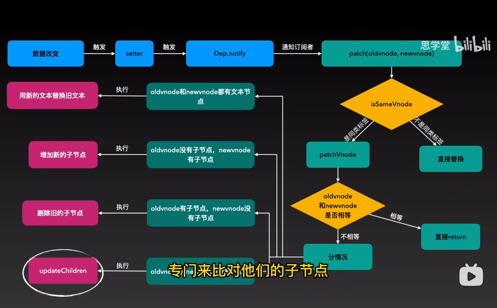
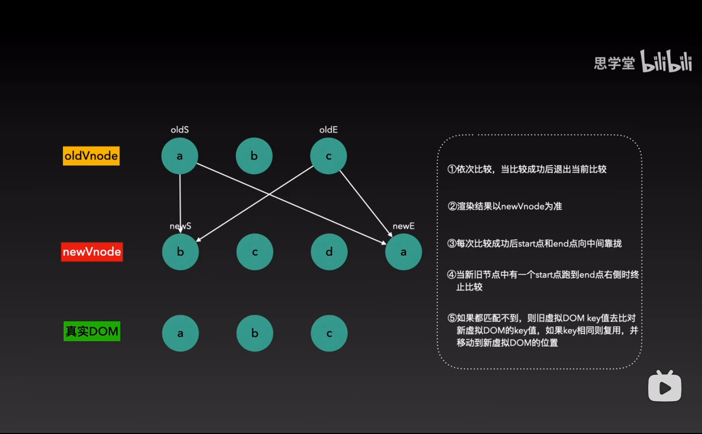
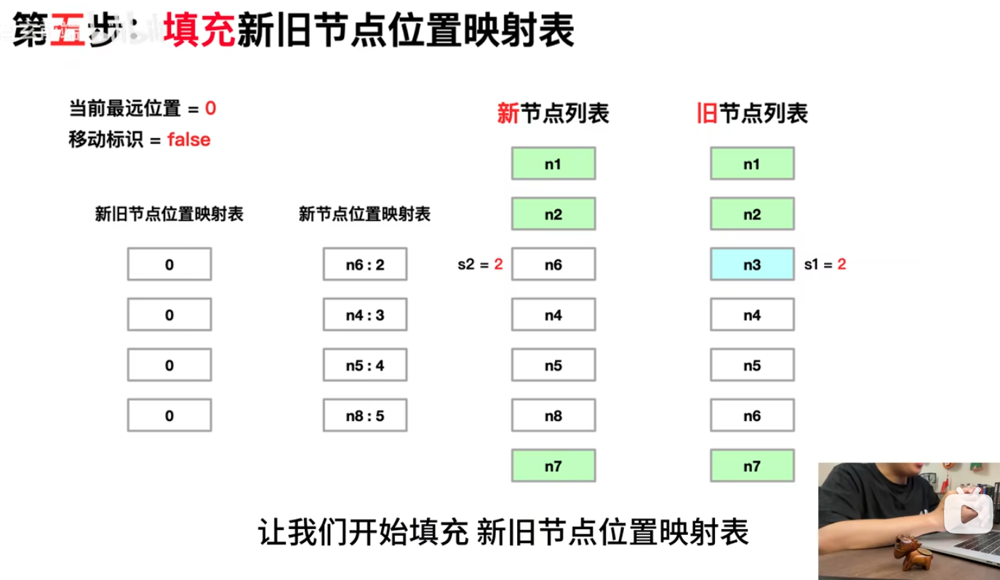
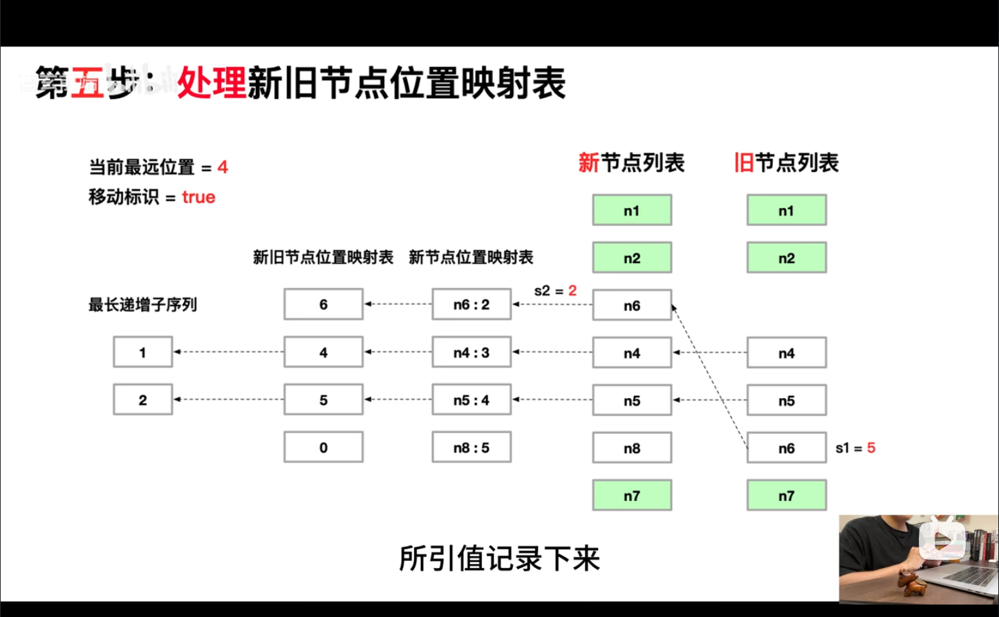
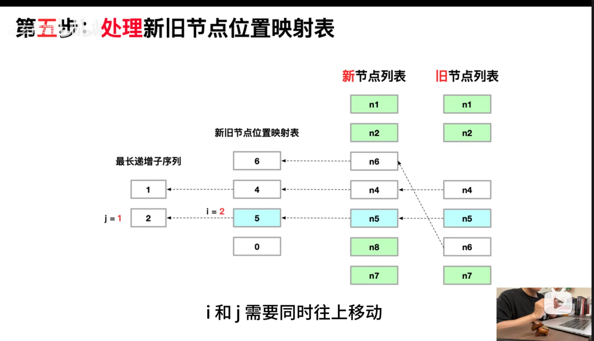

## vue2 和 vue3 中的 diff 算法

1. vue2
   
   
   解释：其中判断 oldVnode 和 newVnode 是否相等的原因是初始化时，非虚拟节点需要先转为虚拟节点
   判断父节点是否相同需要 key 相同且 sel(选择器标签) 相同
   updateChildren 这里会采用一下四个比较规则，如果当前规则未命中则使用下一个规则，命中就不会继续
   1：新前与旧前
   2：新后与旧后
   3：旧后与新前 将旧后移动到旧前的前面
   4：旧前与新后 将旧前一道旧后的后面

2. vue3
   vue3 有个快速排序，首先进行预处理 新前旧前 新后旧后 进行比较 这里会出现一些过滤（可直接判断新增或删除情况） 对于剩下未处理的
   1：创建一个新位置映射表 2.创建一个新旧位置映射表 初始化为 0  
   3.创建一个指针 s1 指向旧前（未处理的） s2 指向新位置映射表 同时定义当前最远位置 far =0 和是否移动标志 flag
   (说明：当前最远位置用于记录新节点中最远位置，用于判断新旧节点在遍历过程中是否同时呈递增趋势，若不是则说明有移动，设置移动标志为 true)
   移动指针，如果当前 s1 所指向的元素，未在新位置映射表中找到则该元素需要删除（卸载）
   若有则在新旧位置映射表中记录旧的位置（s1+1)
   之后 对比新旧位置映射表 和 新位置映射表 找出最长公共子序列 从后向前遍历，
   a. 对新元素位置映射表中值为 0 的，则新增;
   b. 在最长字串序列中则不动
   c.不在最长字串中则需要移动
   
   
   
