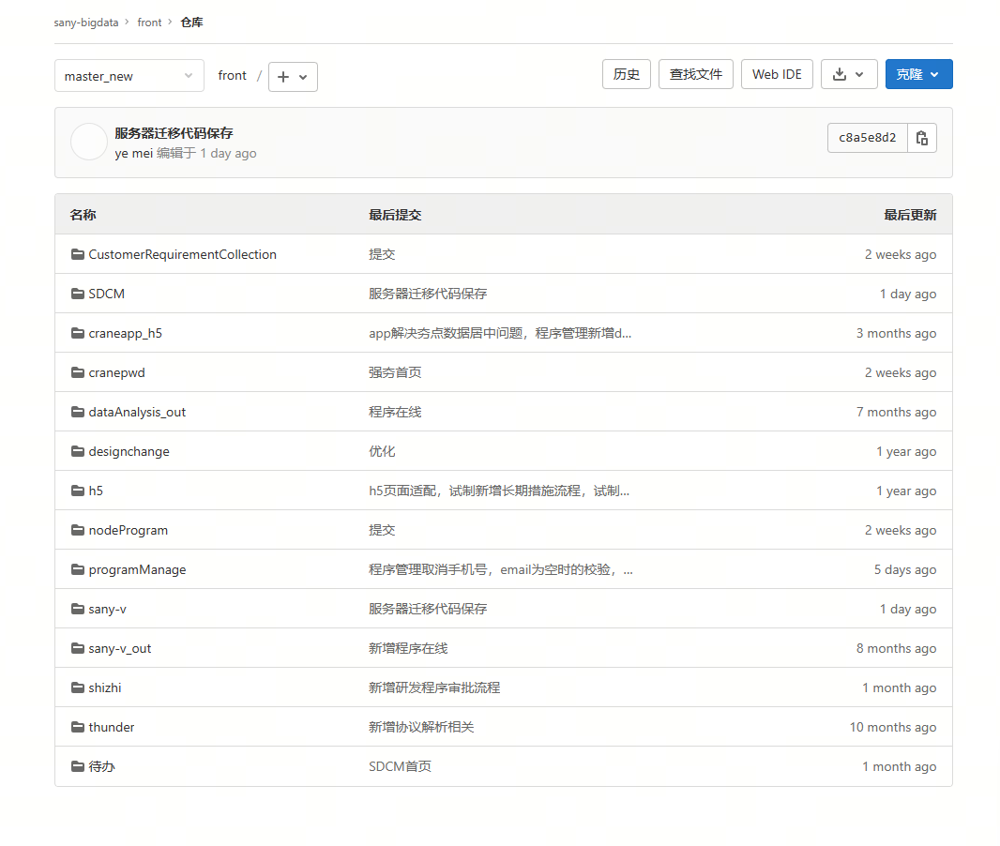
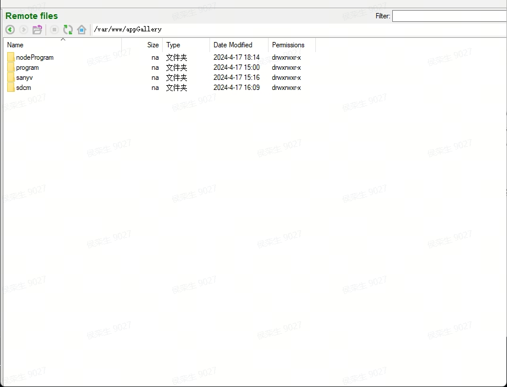

<h3>10.70.41.51树根服务器迁移说明</h3>

#### 前端相关
 -  **gitlab代码仓库**：
    - 湖州装备C端数据应用仓库  （==sany-v==）
    - 三一装备程序在线管理系统  (==programManage==)
    - 试验看板 （==待办==）
    - 试制追溯  （==shizhi==）
    - 设计雷区在线查询 （==thunder==）
    - 数据协议解析 （==dataAnalysis_out==）
    - 高危自定义短信推送h5 (==h5==)
    - 涉及变更 （==designchange==）
    - 强夯app (==craneapp_h5==)
    - 控制所密码计算（==cranepwd==）
    - 研发需求管理（==CustomeRequirementCollection==）
    - 强夯数字化施工平台（==SDCM==）
    - node后端 （==nodeProgram==） 

 - **部署**
    - web应用      /var/www/appGallery/
    - 飞书小程序   飞书开发者后台
    - node后端     /var/www/appGallery/nodeProgram

#### 服务相关
服务器从10.70.41.51迁移到10.130.207.162，主要服务如下：
 - 域名解析:cranebd.sany.com.cn -> 两台负载均衡服务器，外网：62.234.200.132，内网：10.130.207.158通过443端口解析至应用部署服务器10.130.207.162
 - 前端nginx配置：/etc/nginx/nginx.conf

说明：   各项目配置运行见项目 README.md
